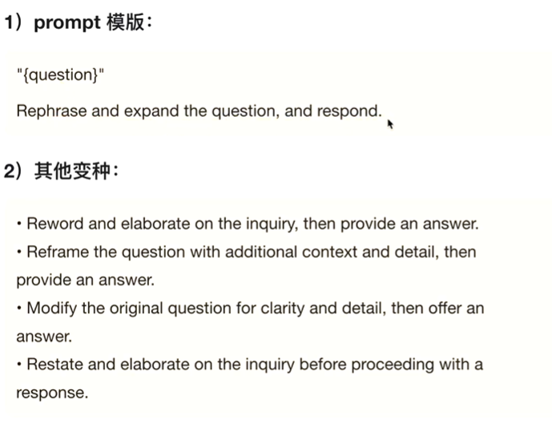

1. 注重业务，不是要很强的技术，注重思考业务
2. 产品（论文搜索引擎）解决英文不好的研究人员的检索和快速寻找paper的难点，减轻研究人员的负担，让研究人员快速进入研究的状态，www.modelpp.com
   1. 将所有arxiv论文转为中文，包括论文简介+算法总结+实验对比
   2. 支持时间+机构+论文内容的检索
   3. 支持中文检索
3. 产品未来规划
   1. 增加论文精翻（直接跳转到翻译的中文论文）
   2. 增加对大模型提问，可提问论文相关的内容
   3. 将每个人的提问公开，形成ai社区
   4. 增加论文检索拓扑图，提升研究者对领域的认知
   5. 增加引用参考文献分屏阅读功能
4. 产品技术实现
   1. query
   2. query改写
   3. embedding
   4. 检索引擎（通过论文供给）
   5. 精排
5. prompt
   1. 任务
   让模型执行的任务说明，定义清楚，简介清晰
   2. 给几个示例few shot
   阐述清楚输入和输出
   3. 输出格式
   一般情况为json输出（前后端容易解析） 例如：请使用json输出，输出key为“分析”和“判定”，“分析”是...,“判定”是...
   4. 角色
   指定模型需要扮演的角色，描述清楚角色的定义和拥有的能力能够让模型更加出色地完成任务
   5. 任务要求
   指定如何执行给定的任务，比如给定分析的思路，让模型按照给定的思路分析
   6. 额外信息
   比如特定领域的专用术语等
   7. 内容格式
   一般使用markdown格式
         1. 标题，#一级标题 ##二级标题。不同内容使用标题分离，比如示例金额任务
         2. 划重点
         ****，模型会进行重点关注
        3. 特殊标记，比如<>
   8. 输出要求json格式
      1. 前面要求json输出
      2. 最后加上：输出（只输出json，不要输出其他内容）
6. 核心术语介绍
   1. prompt
   2. shot
   3. In-context Learning(ICL)
   没有参数，表示大模型从给定的示例或者任务要求、其他信息中学到的知识（上下文学习）
7. few shot方案介绍
   1. 示例的六要素
      1. 示例质量（包括正例和反例等）
      2. 示例顺序（简单放在前面，复杂的放在最后，大模型会更加理解更近的文本）
      3. 标签分布（均匀化）
      4. 标签质量
      5. 示例格式需要统一
      6. 示例相似
   2. 示例的书写方式
   json格式 #示例 ##示例一
   3. 静态示例
      1. 尽量全面，覆盖可能出现的情况
      2. 质量要高（模棱两可和太简单的不要放）
      3. 均衡化
      4. 正向示例和反向示例
   4. 动态示例
      1. 在解决问题时，找到与该问题类似的示例，放入prompt中能够知道模型更好地回答问题，提升回答的质量。将query与示例库中的示例进行检索，再与prompt拼接。
8. prompt engineering技巧
   1. 改写query
   
   能够更加清晰地回答客户的问题，并组织回答的方式
   请重新梳理用户的问题，是问题更加的清晰和明确，如果问题有多个细节和要求，需要全部梳理出来没然后再回答用户的问题。
