## 小红书推荐系统

1. 转化流程
   1. 曝光
      1. 点击
         1. 滑动到底
            1. 评论
         2. 点赞
         3. 收藏
         4. 转发
2. 消费指标
   1. 点击率 （点击此处/曝光次数）
   2. 点赞率  (点赞次数/点击次数)
   3. 收藏率
   4. 转发率
   5. 阅读完成率 (滑动到底次数/点击次数 * f(笔记长度))
3. 北极星指标
   1. 用户规模 (日活用户数、月活用户数)
   2. 消费 (人均使用推荐的时长，人均阅读笔记的数量)
   3. 发布 (发布渗透率、人均发布量)
4. 实验流程
   1. 离线实验
      1. 历史数据训练测试，不与用户进行交互
   2. 小流量AB测试
      1. 算法部署到实际产品中，用户交互（实验组，对照组）
   3. 全流量上线

## 推荐系统的链路
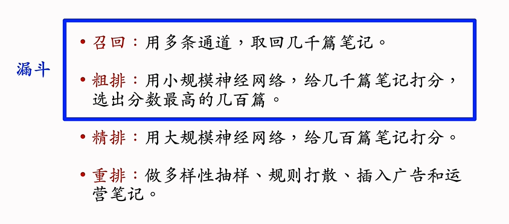

1. 召回通道
   1. 协同过滤
   2. 双塔模型
   3. 关注的作者

2. 粗排 （考虑计算的问题，使用简单的模型筛选，快速打分）
3. 精排 （模型比较大，打分更可靠，但计算量也比较大）
4. 重排 （考虑多样性，随机抽样 MMR,DPP， 规则打散相似笔记，插入广告、运营推广内容 ）

## A/B测试
1. 协助调参
2. 随机分桶

3. 分层实验
   1. 解决流量不够用的问题
   
4. Holdout机制
   1. 多层实验叠加会有折损
   2. 使用10%holder桶，计算diff叠加
   3. 考核周期结束重新划分，开始下一轮
5. 实验推全和反转实验
   1. 有的指标立刻收到新策略影响，有的指标需要长期观测
   2. 实验观测到显著收益后需要尽快推全新策略，可以腾出桶供其他实验使用
   3. 反转实验可以解决上述矛盾，既可以尽快推全，也可以长期观测实验指标
   4. 在推全的新层中开一个旧策略的桶，长期观测实验指标
## 基于物品的协同过滤（ItemCF）
1. 原理
 

2. 物品相似度
   1. 两个物品的受众重合度越高，两个物品越相似
   2. 计算物品相似度
    
    余弦相似度
    
    

3. ItemCF的完整流程
   1. 事先做离线计算
      1. 建立 用户-> 物品 的索引
      2. 物品 -> 物品 相似度 
   2. 线上召回
   
   用索引，离线计算量大，线上计算量小
4. Swing召回通道（与ItemCF的区别物品的相似度定义不一样）
   1. ItemCF的物品相似度：如果喜欢物品1和物品2的用户有很大重叠，那么这两个物品相似
   2. Swing是给用户设置权重，解决小圈子问题
   
   

## 基于用户的协同过滤（UserCF）
1. UserCF的原理

2. UserCF的实现

3. 用户的相似度

越热门的物品越无法反应用户的兴趣，对计算相似性没有用，重合的物品越冷门越能反应相似度，降低热门物品的权重

4. UserCF的完整流程
   1. 事先做离线计算
      1. 用户 -> 物品 索引
      2. 用户 -> 用户 索引
   2. 线上做召回
   

## 离散特征处理
1. 离散特征
   1. 性别
   2. 国籍
   3. 英文单词
   4. 物品id
   5. 用户id
2. 离散特征处理
   1. 建立字典：把类别映射成序号
   2. 向量化：把序号映射成向量
      1. one-hot(高维稀疏向量)
      2. embedding(低维稠密向量)
3. one-hot编码
   1. 局限性：高维，难处理
4. embedding

## 矩阵补充

1. 在实践中效果不好
   1. 仅使用id embedding,没有利用物品和用户属性
   双塔模型：矩阵补充的升级版（加上物品和用户属性）
   2. 负样本选取方式不对
      负样本选取的是曝光之后没有点击交互的样本
   3. 做训练的方法不好
      1. 内积不如余弦相似度
      2. 平方损失不如交叉熵损失
2. 模型存储
   
3. 线上服务
 
4. 加速最近邻查找
   
   先聚类，聚类中心单位向量表示该区域的代表，加快速度

## 双塔模型：模型和训练
1. 矩阵补充模型只用到了物品id和用户id，没有使用到物品和用户的属性

2. 正负样本选择
   1. 正样本：用户点击的物体
   2. 负样本：
      1. 没有被召回的
      2. 召回但是被粗排精排淘汰的
      3. 曝光但是未点击的
3. pointwise训练
   1. 召回看成二元分类任务
   2. 正样本，鼓励余弦相似度接近+1
   3. 负样本，鼓励余弦相似度接近-1
   4. 控制正负样本数量1：2或1：3
4. pairwise训练
   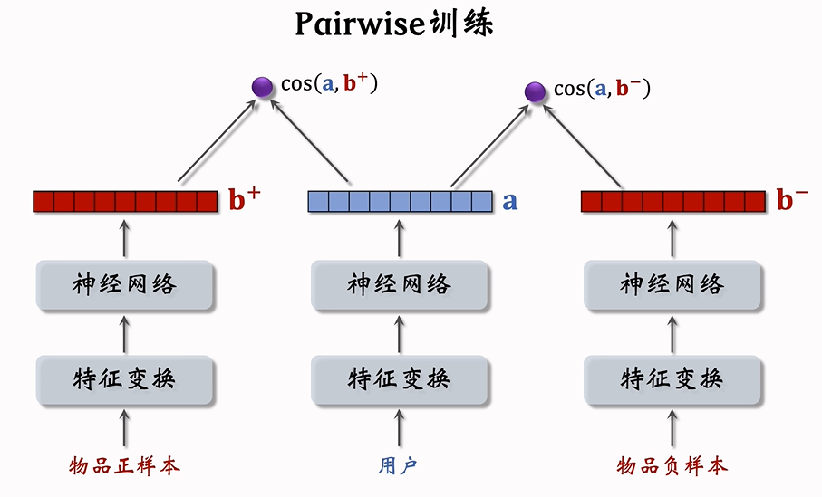
   
   
5. listwise训练 
   

## 双塔模型：正负样本选择
1. 正样本
   1. 曝光且有点击的用户-物品二元组
   2. 问题：少部分物体占据了大部分的点击，导致正样本大多都是热门物品
   3. 解决方案：过采样冷门物品，降采样热门物品
      1. up-sampling:一个样本出现多次
      2. down-sampling:一些样本被抛弃
2. 负样本
   1. 没有被召回
   2. 被找回，但是没有选中和曝光
   3. 被曝光，但是没有被用户点击
3. 简单负样本
   
   
   
   热门无物品成为负样本的概率过大，造成偏差。
   
   纠正偏差，避免过度打压热门物品
4. 困难负样本
   1. 粗排淘汰的样本（比较困难）
   2. 精排淘汰的样本（非常困难）
5. 训练数据
   1. 混合几种负样本
   2. 50%的负样本是全体数据
   3. 50%的负样本是没通过排序的物品
6. 常见的错误
   1. 把曝光但没有点击的样本作为负样本（错误）
   
   训练召回模型不能用这类负样本
   训练排序模型会用这类负样本
   2. 选择负样本的原理
      1. 召回的目标是快速找到用户可能感兴趣的物品（区分不感兴趣和可能感兴趣的物品，排序的任务是区分比较感兴趣物品和非常感兴趣的物品）
   

## 双塔模型：线上召回和更新
1. 线上召回
   1. 离线存储
   
   当用户发起请求时，才在线得到用户embedding，而物品向量b进行离线存储到向量数据库
   2. 把几亿个物品向量b存入向量数据库（比如Milvus、Fassi、HnswLib）
   3. 向量数据库建索引（向量空间划分为若干个区域），加速最近邻查找
   4. 线上召回：查找用户最感兴趣的k个物品
2. 为什么存储物品向量b，线上现算用户向量a？
   1. 每做一次召回，只用到一个用户向量a，几亿个物品向量b，线上算物品向量的代价过大
   2. 用户的兴趣动态变化，而物品特征相对稳定（离线存储用户向量，推荐效果不好）
3. 模型更新
   1. 全量更新：今天凌晨，用昨天全天的数据训练模型
      1. 昨天模型参数的基础上做训练
      2. 用昨天的数据训练1个epoch
      3. 发布新的用户塔nn和物品vector，供线上召回使用
      4. 全量更新对数据流、系统的要求比较低
   2. 增量更新：做online learning更新模型参数
      1. 用户兴趣随时发生变化
      2. 实时收集线上数据，做流式处理，生成TFRecord文件
      3. 对模型做online learning,增量更新ID Embedding参数，不更新神经网络其他部分的参数
      4. 发布用户ID Embedding，供用户塔在线上就散用户向量
   
   3. 只做增量效果不好，最好两个都使用。
      1. 小时级数据有偏；分钟级别数据偏差更大
      2. 全量更新：random shuffle一天的数据，做1epoch训练
      3. 增量更新：按照数据从早到晚的顺序，做1epoch训练
      4. 随机打乱优于按顺序排列数据，全量更新训练优于增量更新训练

## 双塔模型+自监督模型（解决长尾分布问题）
1. 双塔模型的问题
   1. 推荐系统的头部效应严重
      1. 少部分物品占据大部分点击
      2. 大部分物品的点击次数不高
   2. 高点击物品的表征学得好，长尾物品的表征学得不好
   3. 自监督学习：做data augumentation,更好地学习长尾物品的向量表征
2. 双塔模型的训练
   1. 
   2. 
   3. 
   4. 
   5. 自监督学习训练物品塔
      1. 
      2. 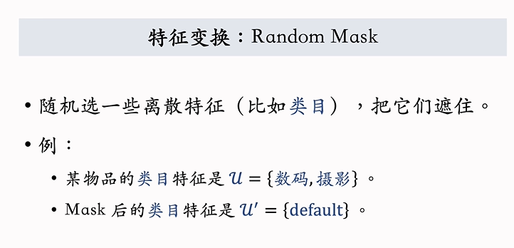 丢掉类目中的所有特征
      3.  丢掉1类目中的一半特征
      4. 
      5. 
      6. 
      7. 
      8. 
   6. 特征变换方法
      1. random mask
      2. dropout
      3. complementary
      4. mask一组关联的特征（通过互信息量化两个特征之间的关联强度）
   7. 训练模型
      1. 从全体物品中均匀抽样，得到m个物品，作为一个batch（双塔模型采用点击次数作为抽样概率，热门物品抽到的概率大）
      2. 做两类特征变换，输出两组向量
      3. 
      4. 
3. 实验效果：低曝光物品、新物品的推荐变得更准
4. 

## Deep Retrieval
1. 双塔模型：用户，物品表示为向量，线上做最近邻查找
2. deep retrieval将物品表征（path），线上查找用户最匹配的路径
3. 类似于阿里的TDM
4. 
5. 索引：把物品和路径关联起来
   1. 一个物品对应多个路径
   2. 比如path = [a,b,c]
   3. 一条路径对应多个物品
6. 预估用户对路径的兴趣
   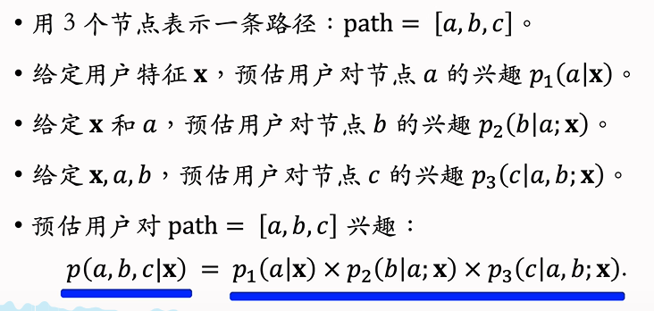
   
7. 线上召回
   1. 用户 -> 路径 -> 物品
   2. 第一步：给定用户特征，使用beam search召回一批路径
   
   
   3. 第二步：利用索引 path -> List(item) 召回一批物品
   4. 第三步：对物品做打分和排序，选出一个子集
8. 训练
   
   
   
   
9. 总结
    
    （deep retrieval召回的本质，使用路径作为用户和物品之间的中介;双塔模型使用向量表征作为用户与物品之间的中介）
    

## 其他召回通道
1. 地理位置召回
   1. GeoHash召回
      1. 用户可能对附近发生的事情感兴趣
      2. GeoHash:将经纬度编码成二进制哈希码，方便检索，地图上一个长方形区域
      3. 索引：GeoHash->优质笔记列表 （按倒序排序，最新的排在最前面）
      4. 召回没有个性化
      5. 
   2. 同城召回
      1. 用户可能对同城发生的事感兴趣
      2. 索引：城市->优质笔记列表（倒序）
      3. 召回通道没有个性化
   3. 作者召回
      1. 用户对关注的作者发布的笔记感兴趣
      2. 用户 -> 关注的作者
         作者 -> 发布的笔记
      3. 召回：给定用户 -> 作者 -> 发布的笔记
   4. 有交互的作者召回
      1. 用户对某笔记感兴趣（电子，收藏，转发），那么用户可能对该作者其他笔记感兴趣
      2. 索引：用户 -> 有交互的作者
      3. 召回： 用户 -> 有交互的作者 -> 最新的笔记
   5. 相似作者召回
      1. 如果用户喜欢某位作者，那么用户喜欢相似的作者
      2. 索引：作者 -> 相似作者
      3. 召回：用户 -> 感兴趣的作者（用户关注的作者和用户有交互的作者） -> 相似的作者 -> 最新的笔记
   6. 缓存召回
      1. 想法：复现前n词推荐精排的结果
      2. 背景
         1. 精排输出几百篇笔记，送入重排
         2. 重排做多样性抽样，送出几十篇
         3. 精排结果一大半没有曝光，被浪费
      3. 精排前50，没有曝光的，缓存起来，作为一条召回通道
      4. 缓存大小固定，需要退场机制
         1. 一旦成功曝光，就从缓存退场
         2. 超出缓存大小，移除最先进入缓存的笔记
         3. 笔记最多被召回10次，达到10次就退场
         4. 笔记最多保存3天，达到3天就退场
2. 地理召回
   1. GeoHash召回
   2. 同城召回
3. 作者召回
   1. 关注的作者
   2. 有交互的作者
   3. 相似的作者
4. 缓存召回

## 曝光过滤 & Bloom Filter
1. 曝光过滤问题
   1. 如果用户看过某个物体，则不再把该物体曝光给该用户
   2. 重复曝光同一个物体，会损害用户体验
   3. 对于每个用户，记录已经曝光给他的物品。（小红书只召回一个月内的笔记，因此只需记录每个用户最近1个月的曝光历史）
   4. 对于每个召回的我，判断是否已经曝光过，排除掉曝光过的物品
   5. 一个用户看过n个物品，本次召回r个物品，如果暴力对比，则需要o(nr)的时间
2. Bloom Filter
   1. Bloom filter判断一个物品是否在已经曝光的物品集合中
   2. 判断为no，则物品一定不在集合中
   3. 判断是yes，物品很可能在集合中（可能误伤，判断错误未曝光物品为已曝光。将其过滤掉）
   4. bloom filter将物品集合表征为一个m为二进制向量
   5. 每个用户有若干曝光物品，这些物品表征为一个向量，需要m bit存储
   6. k个哈希函数，把物品id映射成介于0-m-1的整数
   7. k = 1
   
   8. k = 3
   
   9. 曝光物品的集合大小为n，二进制向量维度为m，使用k个哈希函数
   10. 
       1. n越大，向量中的1越多，误伤概率越大
       2. m越大，向量越长，越不容易发生哈希碰撞
       3. k太大太小都不好，有最优值
       4. 
       5. 缺点 

## 多目标排序模型
1. 排序的依据
   1. 排序模型预估点击率，点赞率，收藏率和转发率等多种分数
   2. 融合这些分数，比如加权和
   3. 根据融合的分数做排序，截断
2. 多目标模型（目标：点击率、点赞量、收藏率、转发率）
   1. 
   2. 
   3. 训练
      1. 困难：类别不平衡
         1. 每一百次曝光，越有10次点击，90次无点击
         2. 每100次点击，约有10次收藏，90次无收藏
      2. 解决方案
         1. 负样本降采样（down-sampling）
            1. 保留一小部分负样本
            2. 让正负样本数量平衡，节约计算
   4. 预估值校准（点击率）
      1. 正样本、负样本数量为n+,n-
      2. 对负样本降采样，抛弃一部分负样本
      3. 使用α*n-个负样本，α是采样率
      4. 负样本变少，预估点击率大于实际点击率
      5. 

## Multi-gate Mixture-of-Experts(MMoE)
1. 
2. 
3. MMoE,softmax会出现极化现象
4. 极化（polarize）:softmax输出值一个接近1，其余接近0
5. 解决极化问题
   1. n个“专家”，每个softmax的输入和输出都是n维向量
   2. 在训练时，对softmax的输出使用dropout
      1. softmax的输出n个数值被mask的概率为10%
      2. 每个专家被丢弃的概率是10%
      3. 如果发生了极化，输出为1的专家被mask，会使得效果极低，为了预测尽量精准，模型会避免极化的发生
   3. 参考文献  

## 预估分数的融合
1. 简单加权和   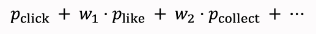
2. 点击率乘以其他项的加权和   
3. 海外某短视频APP的融分公式    
4. 国内某短视频app的融分方式     使用预测出来的排名，再根据排名算出分数，再进行加权求和
5. 国内某电商的融分公式   

## 视频播放建模（播放时长和播放完播率）
1. 图文 vs 视频
   1. 图文笔记的排序
      1. 点击、点赞、收藏、转发、评论
   2. 视频排序的依据
      1. 还有播放时长和完播
   3. 直接用回归拟合播放时长效果并不好
2. 
3. 视频播放时长建模
   1. 最后一层全连接输出记为z，p=sigmoid(z)
   2. 实际观测播放时长记为t
   3. 训练时，最小化交叉熵损失 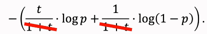
   4. 推理时，exp(z)作为播放时长的预估
   5. 把exp(z)作为融分的一项
4. 视频完播
   1. 回归
      1. 视频长度10分钟，实际播放4分钟，实际播放率0.4
      2. 预估播放率拟合y  
   2. 二元分类
      1. 定义完播率 ，比如80%
      2. 播放大于8分钟作为正样本，播放小于8分钟作为负样本
      3. 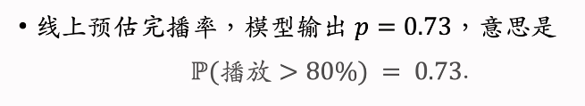
      4. 不能直接将预估的完播率用到融分公式中，对长视频不公平，长视频完播率比较难
      5. 

## 排序模型的特征
1. 用户画像 user profile
   1. 用户id(通常为36维，64维)
   2. 人口统计学属性：性别，年龄
   3. 账号信息：新老，活跃度
   4. 感兴趣的类目：关键词、品牌
2. 物品画像 item profile
   1. 物品id
   2. 发布时间
   3. GeoHash、所在的城市
   4. 标题、类目、关键词、品牌
   5. 字数、图片数、视频清晰度、标签数
   6. 内容信息量、图片美学
3. 用户统计特征
   1. 用户最近30天（7天、1天、1小时）的曝光数、点击数、点赞数、收藏数、...
   2. 按照笔记图文/视频分桶（比如最近7天，该用户对图文笔记的点击率、对视频笔记的点击率）
   3. 按照笔记类目分桶（比如最近30天，用户对美妆笔记、美食笔记、科技数码笔记的点击率等等）
4. 笔记的统计特征
   1. 笔记最近30天（1天，1小时）的曝光数、点击数、点赞数、收藏数，...
   2. 按照用户笔记分桶、按照用户年龄分桶、...
   3. 作者特征
      1. 发布笔记数
      2. 粉丝数
      3. 消费指标
5. 场景特征context
   1. 用户定位GeoHash、城市
   2. 当前时刻
   3. 是否是周末、是否是节假日
   4. 手机品牌、手机型号、操作系统
6. 特征处理
   1. 离散特征：做embedding
      1. 用户id,笔记id,作者id
      2. 类目、关键词、城市、手机品牌
   2. 连续特征：做分桶，变成离散特征
      1. 年龄、笔记字数、视频长度
   3. 连续特征：其他变换
      1. 曝光数、点击数、点赞数等数值做；log(1+x)  (长尾分布) 解决异常值问题
      2. 转化为点击率、点赞率等值，并做平滑
7. 特征覆盖率
   1. 很多特征无法覆盖100%样本
   2. 比如，用户不填写年龄，缺失年龄信息
   3. 比如，用户设置隐私权限，缺失地理场景信息
   4. 提高特征覆盖率，可以让精排模型更加准确
8. 数据服务
   1. 用户画像
   2. 物品画像
   3. 统计数据
   4. 

## 粗排
1. 粗排 vs 精排
   1. 粗排
      1. 给几千篇笔记打分
      2. 单次推理代价必须小
      3. 预估准确性不高，做初步筛选，保持速度
   2. 精排
      1. 给几百篇笔记打分
      2. 单次推理代价很大
      3. 预估准确度更高
2. 精排模型 
   1. 前期融合：先对所有特征做concatenation，在输入神经网络
   2. 线上推理代价大：如果有n篇候选笔记，整个大模型需要做n次推理
3. 双塔模型（召回阶段） 
   1. 把用户和物品特征分别输入不同的神经网络，不对物品和用户特征做融合
   2. 线上计算量小
      1. 用户塔只需要做一次线上推理，计算用户表征a
      2. 用户表征b事先存储在向量数据库中，物品塔在线上不做推理
   3. 预估准确性不如精排模型
4. 粗排的三塔模型   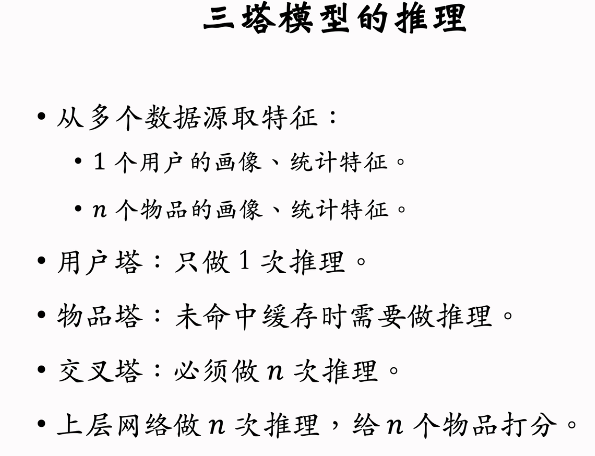

## Factorized Machine (FM)
1. 线性模型  特征没有相乘，没有交叉
2. 二阶交叉特征    d很大，模型参数量很大，计算代价很大，容易出现overfitting
3. 低秩近似
4. 
5. FM是线性模型的替代品，能用线性回归和逻辑回归的场景都能使用FM
6. FM使用二阶交叉特征，模型表达能力比线性模型更强
7. 低秩近似分解，降低参数量

## 深度交叉网络（DCN）（排序、召回都可以使用）
1. 召回、排序模型
   1. 
   2. 
   3. 
2. 交叉层
      1. 
      2. 
      3. 
3. 深度交叉网络
   1. 

## LHUC网络结构（精排） Learning Hidden Unit Contributions
1. 语音识别中的LHUC
   1. 
   2. 
   3. 

## SENet & Bilinear Cross
1. SENet
   1. 
   2. 
   3. 对离散特征做field-wise加权
   4. Field
      1. 用户id embedding是64维向量
      2. 64个元素算一个field，获得相同的权重
   5. m个fields,那么权重是m维
2. Feild间的特征交叉
   1. feild embedding的大小相同
      1. 内积 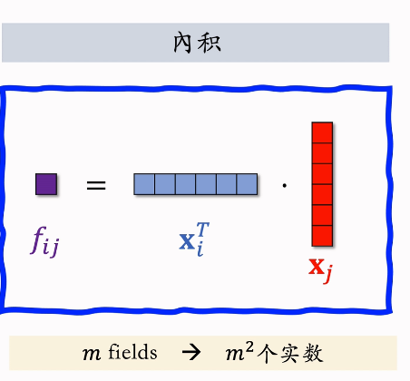
      2. 哈达玛乘积  
   2. feild embedding的大小可以不同（引入参数矩阵）
      1. Bilinear Cross（内积）
      2. Bilinear Cross(哈达玛乘积)  
3. FiBiNet (SENet和Bilinear Cross结合)

## 用户行为序列建模
1. LastN特征
   1. 用户最近n次交互的物品id
   2. lastN物品id做embedding，得到n个向量
   3. n个向量平均，作为用户的一个特征
   4. 

## DIN模型
1. 
2. DIN模型
   1. 使用加权平均代替平均，即注意力机制
   2. 权重：候选物品与LastN物品的相似度
   3. 
   4. 
3. 

## SIM模型（保留用户的长期兴趣）
1. DIN模型   
2. DIN模型的缺点
   1. 计算量正比于n（用户行为序列的长度）
   2. 只能记录最近几百个物品，否则计算量太大
   3. 缺点：关注短期兴趣，遗忘了长期兴趣
3. 如何改进DIN
   1. 目标：保留用户长期行为序列（n很大），而且计算量不会太大
   2. 改进DIN
      1. DIN对LastN物品做加权平均，权重是相似度
      2. 如果某LastN物品与候选物品差距很大，则权重接近0
      3. 快速排除掉与候选物品无关的LastN物品，降低注意力层的计算量
4. SIM模型
   1. 保留用户长期的行为记录，n的大小可以是几千
   2. 对于每个候选物品，在用户LastN记录中做快速查找，找到k个相似物品
   3. 把LatN变成了TopK，然后输入注意力层
   4. SIM模型减少了计算量
5. SIM模型流程
   1. 第一步：查找
      1. 方法一：Hard Search
         1. 根据候选物品的类目，保留LastN中类目相同的
         2. 简单、快速、无需训练
      2. 方法二：Soft Search
         1. 把物品做embedding,变成向量
         2. 把候选物品的向量作为query，做最近邻查找，保留LastN中最接近的k个
         3. 效果更好，编程实现更复杂
   2. 第二步：注意力机制
      1. 使用TopK物品做加权求和
      2. 使用时间信息  
6. 为什么SIM模型使用时间信息
   1. DIN序列短，记录用户近期行为
   2. SIM序列长，记录用户长期行为
   3. 时间越久远，重要性越低
7. 结论
   1. 长序列优于短序列
   2. 注意力机制优于简单平均
   3. soft search还是hard search取决于工程基建
   4. 使用时间信息有提升
   
## 推荐系统中的多样性
1. 物品相似性的度量
   1. 基于物品属性标签
      1. 类目、品牌、关键词
   2. 基于物品向量表征
      1. 用召回的双塔模型学到的物品向量（不好）
      2. 基于内容的向量表征（好）
2. 基于物品属性标签
   1. 物品属性标签：类目、品牌、关键词
   2. 根据一级类目、二级类目、品牌计算相似度
      1. 物品i：美妆、彩妆、香奈儿
      2. 物品j：美妆、香水、香奈儿
      3. 相似度：
      4. 加权求和
3. 基于向量表征
   1. 双塔模型的物品向量表征优于：由于长尾现象，模型学不好新物品和长尾物品的向量表征
   2. 基于图文内容的表征 
      1. CLIP 
      2. 
4. 提升多样性的方法
   1. 推荐系统的链路  

## Maximal Marginal Relevance(MMR)
1. 多样性 
2. MMR 
3. MMP算法流程  
4. 滑动窗口    

## 重排的规则
1. 最多连续出现k篇某种笔记
2. 每k篇笔记最多只出现1篇某种笔记
3. 前t篇笔记最多出现k篇某种笔记
4. MMR与重排规则结合  

## DPP：数学基础
1. 超平行体     
2. 衡量物品的多样性   用行列式衡量物体的多样性，行列式代表着物体向量张成的超平行体的体积，代表着向量组线性相关或者线性无关

## DDP：多样性算法
1. 多样性问题   
2. 行列式点过程（DPP） 
3. 求解DPP 
4. Hulu的快速算法    
5. DPP的扩展 
6. 规则约束  
   
## 物品冷启动：评价指标
1. 物体冷启动（UGC）
   1. 小红书用户新发布的笔记
   2. b站用户新上传的视频
   3. 今日头条作者新发布的文章
2. 新笔记冷启动
   1. 为什么要特殊对待冷笔记
      1. 新笔记缺少与用户的交互，导致推荐的难度大、效果差
      2. 扶持新发布、低曝光的笔记，可以增强作者发布的意愿
3. 优化冷启动的目标
   1. 精准推荐：克服冷启动的困难，将新笔记推荐给合适的用户，不引起用户反感
   2. 激励发布：流量向低曝光新笔记倾斜，激励作者发布
   3. 挖掘高潜：通过初期小流量的试探，找到高质量的笔记，给与流量倾斜
4. 评价指标
   1. 作者侧指标（反映作者的发布意愿）
      1. 发布渗透率、人均发布量 
   2. 用户侧指标（反映推荐是否精准）
      1. 新笔记指标：新笔记的点击率、交互率  
      2. 大盘指标：消费时长、日活、月活  
   3. 内容侧指标
      1. 高热笔记占比  
5. 冷启动优化点
   1. 优化全链路（召回、排序）
   2. 流量调控（流量怎么在新老物品中分配）
   
## 物品冷启动：简单的召回通道
1. 召回的难点
   1. 召回的依据 
   2. 冷启动召回的困难  
2. 双塔模型
   1. ID Embedding   
   2. 多个向量召回池 
3. 类目召回
   1. 用户画像 
   2. 基于类目的召回 
4. 基于关键词的召回 
5. 类目和关键词召回的缺点  

## 物体冷启动：聚类召回
1. 基本思想
   1. 如果用户喜欢一篇笔记，那么他会喜欢内容相似的笔记
   2. 事先训练一个神经网络，基于笔记的类目和图文内容，将笔记映射成一个向量
   3. 对笔记向量做聚类，划分为1000个cluster,记录每个cluster的中心方向。（kmeans聚类等）
2. 聚类索引
   1. 新笔记变为向量
   2. 从1000个中心向量与该向量比较，找到最相似的向量，作为新笔记的cluster
   3. 索引：cluster -> 笔记ID列表
3. 线上召回
   1. 给定用户id，找到他的last-N交互的笔记列表，将这些笔记作为种子笔记
   2. 种子笔记映射到向量，寻找最相似的cluster
   3. 从每个cluster的笔记列表中取回最新的m篇笔记
   4. 最多取回mn篇新笔记
4. 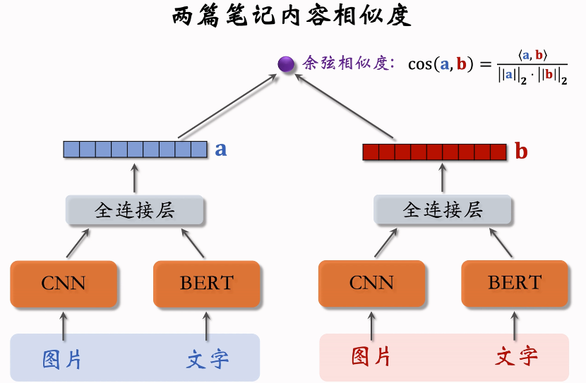
5. 模型的训练  
6. 正样本 
7. 负样本 
8. 聚类召回总结 

## 物体冷启动：Look-Alike人群扩散
1. Look-Alike用于互联网广告    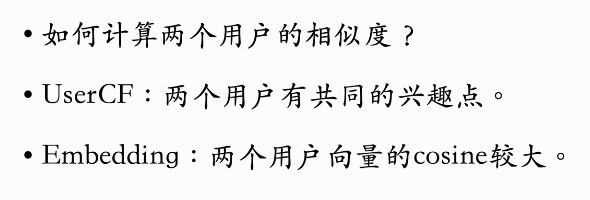
2. Look-Alike用于新笔记召回
   1. 点击、点赞、收藏、转发----用户对笔记可能感兴趣
   2. 把有交互的用户作为新笔记的种子用户
   3. 用look-alike在相似用户中扩散
3. look-alike流程   

## 物品冷启动：流量调控
1. 扶持新笔记的目的
   1. 促进发布，增大内容池
   2. 挖掘出优质笔记
2. 工业界的做法 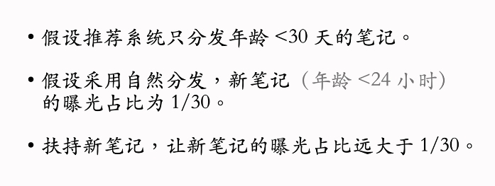 
3. 新笔记的提权（boost）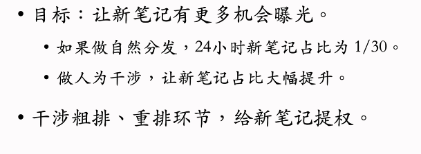 
4. 新笔记保量 
5. 动态提权保量 
6. 保量的难点   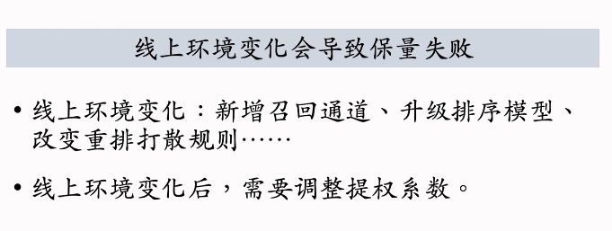 
7. 差异化保量     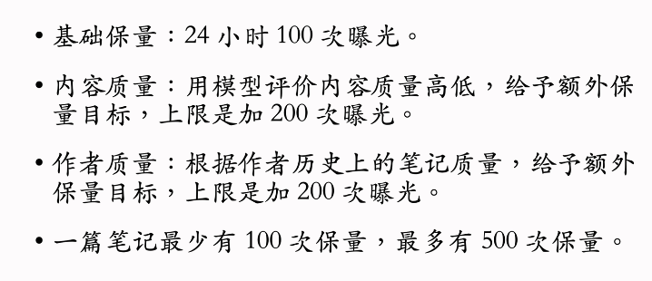
8. 总结 

## 物品冷启动：AB测试
1. 新笔记冷启的AB测试
   1. 作者侧指标
      1. 发布渗透率、人均发布率
   2. 用户侧指标
      1. 新笔记的点击率、交互率
      2. 大盘指标：消费时长、日活、月活

## 涨指标的方法
1. 推荐系统的评价指标
   1. 日活用户数和留存是最核心的指标
   2. 目前工业界最常用LT7和LT30衡量留存
      1. 某用户今天登录app,未来7天中有4天登录app，则该用户今天的LT7等于4
      2. LT增长通常意味着用户体验上升
      3. 
   3. 其他核心指标：用户使用时长、总阅读数、总曝光数
   4. 非核心指标：点击率、交互率、等等
   5. UGC平台，发布量和发布渗透率也是核心指标
2. 涨指标的方法
   1. 改进召回模型，添加新的召回模型
   2. 改进粗排和精排模型
   3. 提升召回、粗排、精排中的多样性
   4. 特殊对待新用户、低活用户等特殊人群
   5. 利用关注、转发、评论这三种交互行为

## 涨指标的方法：召回
1. 召回模型 & 召回通道
   1. 推荐系统有几十条召回通道，他们的召回总量是固定的。总量越大、指标越好、粗排的计算量越大
   2. 双塔和iten-to-item是最重要的两类召回模型，占据召回的大部分配额
   3. 有很多小众的模型。占据配额小，可以提升核心指标
   4. 有很多内容池，比如30天物品、1天物品、6小时物品，新用户优质内容池、分人群内容池等等
   5. 同一个模型可以用于多个内容池，得到多条召回通道
2. 双塔模型
   1. 改进双塔模型
      1. 方向1：优化正样本、负样本
         1. 简单正样本：有点击的（用户、物品）二元组
         2. 简单负样本：随机组合的（用户、物品）二元组
         3. 困难负样本：排序靠后的（用户、物品）二元组
      2. 改进神经网络结构  
      3. 改进模型的训练方法 
3. Item-to-Item(I2I)
   1. 基于相似物品做召回
      1. 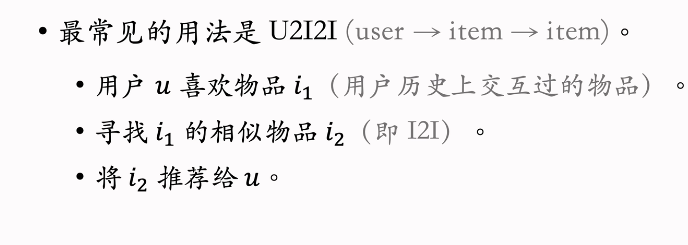
      2. 物品相似度  
4. 小众的召回模型
   1. 类似I2I的模型 
   2. 更复杂的模型   
5. 总结：该改进召回模型 

## 涨指标的方法：排序模型
1. 排序模型
   1. 精排模型的改进
   2. 粗排模型的改进
   3. 用户行为序列建模
   4. 在线学习
   5. 老汤模型
2. 精排模型的改进
   1. 
   2. 精排模型：基座
      1. 基座的输入包括离散特征和连续特征，输出一个向量，作为多目标预估的输入
      2. 改进1：基座加宽加深，计算量更大，预测更准确
      3. 改进2：做自动的特征交叉，比如bilinear和LHUC
      4. 改进3：特征工程，比如添加统计特征、多模态内容特征
   3. 精排模型：多目标预估
      1. 基于基座输出的向量，同时预估点击率等多个目标
      2. 改进1：增加新的预估目标，将预估结果加入融合公式
      3. 改进2：MMoE和PLE等结构可能有效
      4. 改进3：纠正position bias可能有效，也可能无效
3. 粗排模型的改进
   1. 粗排模型
      1. 粗排的打分量比精排大了10倍，因此粗排模型必须够快
      2. 简单模型：多向量双塔模型，同时预估点击率等多个目标
      3. 复杂模型：三塔模型效果好，但工程实现难度较大
   2. 粗精排一致性建模
      1. 蒸馏精排模型训练粗排，让粗排和精排更加一致
      2. 方法1：pointwise蒸馏
         1. 设y是用户真实行为，设p是精排的预估
         2. 用(y+p)/2作为粗排拟合的目标
      3. 方法2：pairwise或listwise蒸馏 
      4. 优点：可以提升核心指标
      5. 缺点：如果精排出bug，精排预估值p有偏，会污染粗排训练数据
## 用户行为序列建模
1. 最简单的方法是对物品向量取平均作为一种用户行为特征
2. DIN使用注意力机制，对物体向量做加权平均
3. 工业界目前沿着SIM的方向发展，先用类目等属性筛选物品，然后用DIN对物品向量组做加权平均
4. 改进1：增加序列长度，让预测更加准确，但是会增加计算成本和推理时间
5. 改进2：筛选的方法，比如用类目、物品向量表征聚类
6. 改进3：对用户行为序列中的物品，使用id以外的一些特征

## 在线学习
1. 全量更新 vs 增量更新 
2. 在线学习的资源消耗  

## 老汤模型
1. 老汤模型
   1. 用每天新产生的数据对模型做1epoch训练
   2. 久而久之，老模型训练非常好，很难被超过
   3. 对模型做改进，重新训练，很难追上老模型
   4. 问题1：如何快速判断新模型结构是否由于老模型
   5. 问题2：如何更快地追平、超过线上的老模型
2. 如何判断新模型结构是否优于老模型
   1. 对于新老模型结构，都随机初始化模型全连接层
   2. embedding层可以是随机初始化，也可以是复用老模型训练好的参数
   3. 用n天的数据训练新老模型
   4. 如果新模型显著优于老模型，新模型很可能更优
3. 如何快速追平线上的模型
   1. 方法1：尽可能多复用老模型训练好的embedding层，避免随机初始化embedding层
   2. 方法2：老模型做teacher,蒸馏新模型
   
## 涨指标的方法：提升多样性
1. 排序多样性
   1. 精排多样性   
   2. 粗排多样性  
2. 召回的多样性
   1. 双塔模型：添加噪声 
   2. 双塔模型：抽样用户行为序列 
   3. U2I2I：抽样用户行为序列 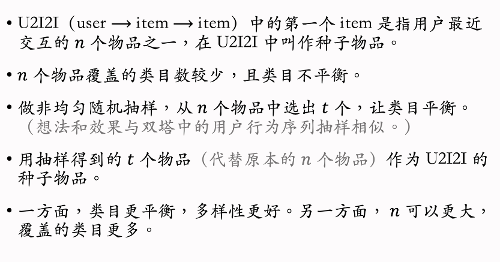
3. 探索流量 
4. 总结：提升多样性 

## 涨指标的方法：特殊对待特殊人群
1. 为什么要特殊对待特殊人群
   1. 新用户、低活用户行为很少，个性化推荐不准确
   2. 新用户、低活用户容易流失，要想办法促使他们留存
   3. 特殊用户的行为不同于主流用户，基于全体用户行为训练出的模型在特殊用户人群上有偏
2. 涨指标的方法
   1. 构造特殊内容池，用于特殊用户人群的召回
   2. 使用特殊排序策略，保护特殊用户
   3. 使用特殊的排序模型，消除模型预估的偏差
3. 构造特殊的内容池
   1. 新用户、低活用户的行为很少，个性化召回不准确，个性化推荐不好，那么就保证内容质量好
   2. 针对特定人群的特点构造特殊内容池，提升用户满意度
   3. 如何构造特殊内容池
      1. 方法1：根据物品获得的交互次数、交互率选择优质物品
         1. 圈定人群
         2. 构造内容池
         3. 内容池有弱个性化的效果
         4. 内容池需要定期更新
         5. 该内容池只对该人群生效
      2. 方法2：做因果推断，判断物品对人群留存率的贡献，根据贡献值选物品
   4. 特殊内容池的召回
      1. 双塔模型是个性化的
      2. 对于新用户，双塔模型的个性化做不准
      3. 靠高质量内容弥补弱个性化
      4. 额外的训练代价
      5. 额外的推理代价 
4. 特殊的排序策略
   1. 排除低质量物品 
   2. 差异化的融分公式 
5. 特殊的排序模型         

## 涨指标的方法：利用交互行为
1. 用户的交互行为
   1. 交互行为：点赞、收藏、妆发、关注、评论、...
   2. 推荐系统怎么利用这种交互行为
   3. 最简单的方法：将模型预估的交互率进行排序
      1. 将交互行为当做预估的目标
      2. 将预估的点击率、交互率做融合，作为排序的依据
   4. 还有没有其他的用途
2. 关注
   1. 关注量对留存的价值
      1. 对于一个用户，他关注的作者越多，则平台对他的吸引力越强
      2. 用户留存率（r）与他关注的作者数量（f）正相关 
      3. 如果用户的f比较小，则推荐系统要促使该用户关注更多作者
      4. 方法1：用排序策略提升关注量 
      5. 方法2：构造促关注内容池和召回通道  
   2. 粉丝对促发布的价值  
   3. 隐式关注关系 
3. 转发（分享）
   1. 促转发（分享回流）
   2. KOL建模  
   3. 促转发的策略  
4. 评论
   1. 评论促发布 
   2. 评论的其他价值 
5. 总结：利用交互行为 