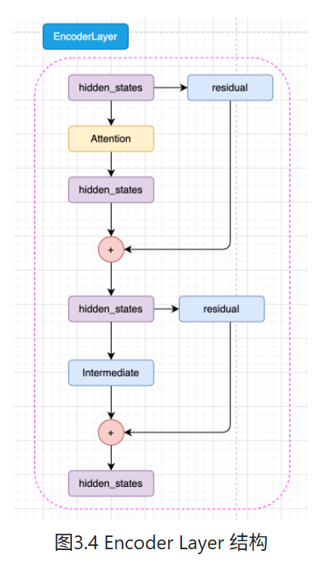
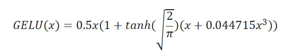

1. 为什么使用transformer，不使用rnn
RNN能够捕捉时序信息，适合序列生成，但是需要串行计算，限制了GPU并行计算的能力，计算时间成本高；RNN难以捕捉长时间序列的关系。

```
def attention(q, k, v, dropout=None):
    d_k = q.size(-1)
    score = torch.matmul(q, k.transpose(-2, -1)) / math.sqrt(d_k)
    p_attn = scores.softmax(dim=-1)

    if dropout is not None:
        p_attn = dropout(p_attn)
    retrun torch.matmul(p_attn, value), p_attn

```


注意力机制正常情况下拟合两个序列，一个序列作为query，另一个序列为key和value，通过序列中的每个token与其他序列的相关性进行加权求和，重新作为该token的表征。在transformer的decoder模块中，Q来自decoder的输入，k,v来自encode的输入，从何拟合了编码信息和历史信息之间的关系，便于综合这两种信息实现未来的预测。

**自注意力机制**
自注意力机制，计算本身序列中每一个元素与其他元素之间的注意力分布，通过参数矩阵Wq,Wk,Wv得到Q,K,V，从而拟合输入句子的每一个token对其他所有token的关系。

`attention(x, x, x)`


**掩码自注意力机制**
mask self-attention
mask的作用是遮蔽一些特定位置的token，在学习的过程中，忽略掉被遮蔽的token。模型只能使用历史信息进行预测，不能看到未来信息，根据之前的token,预测下一个token不断补全文本序列。
通过mask实现并行，不用一个一个进行串行处理。

```
mask = torch.full((1, args.max_seq_len, max_seq_len), float("-inf"))
mask = torch.triu(mask, diagonal=1)

torch.triu保留上三角，包括主对角线，下三角填充为0 diagonal=1（不包括主对角线）

torch.tril保留下三角，包括主对角线，上三角填充为0
```

```
scores = scores + mask[:, :seqlen, :seqlen]
scores = F.softmax(scores.float(), dim=-1).type_as(xq)
```

**多头注意力机制**
通过不同的注意力机制拟合不同的相关关系
将原始的输入序列进行多组的自注意力机制处理，再将结果拼接，通过一个线性层处理，得到最终的输出
```
class MultiHeadAttention(nn.Module):
    def __init__(self, hid_dim, n_heads):
        super().__init__()
        self.n_heads = n_heads
        self.head_dim = hid_dim // n_heads
        self.q_linear = nn.Linear(hid_dim, hid_dim)
        self.k_linear = nn.Linear(hid_dim, hid_dim)
        self.v_linear = nn.Linear(hid_dim, hid_dim)
        self.o_linear = nn.Linear(hid_dim, hid_dim)

    def forward(self, x, mask=None, past_key_value=None, kv_cache=False):
        query = self.q_linear(x)
        key = self.k_linear(x)
        value = self.v_linear(x)

        bsz = query.size(0)
        query = query.view(bsz, -1, self.n_heads, self.head_dim).transpose(1, 2)
        key = key.view(bsz,-1, self.n_heads, self.head_dim).transpose(1, 2)
        value = value.view(bsz, -1, self.n_heads, self.head_dim).transpose(1, 2)

        if past_key_value is not None:
            past_key, past_value = past_key_value
            key = torch.cat([past_key, key], dim=2)
            value = torch.cat([past_value, value], dim=-2)

        new_past_key_value= (key, value) if kv_cache else None

        scores = torch.matmul(query, key.transpose(-1, -2)) / math.sqrt(self.head_dim)

        if mask is not None:
            scores = scores.masked_fill(mask==0, float("-inf"))

        p_attn = F.softmax(scores, dim=-1)
        output = torch.matmul(p_attn, value).transpose(1, 2).contiguous().view(bsz, -1, self.n_heads * self.head_dim)
        output = self.o_linear(output)

        return (output, new_past_key_value) if kv_cache else output

```


## Encoder-Decoder

### Seq2Seq
输入sequence，输出sequence
一般思路：对于自然语言序列先进行编码再进行解码

transformer由encoder和decoder组成，每个encoder和decoder分别由6个layer组成。将encoder最终的输出作为decoder的输入

### FFN
由两层MLP，1个relu，和dropout组成
```
class MLP(nn.Module):
    def __init__(self, dim, hidden_dim, dropout):
        super().__init__()
        self.w1 = nn.Linear(dim, hidden_dim, bias=False)
        self.w2 = nn.Linear(hidden_dim, dim, bias=False)
        self.dropout = nn.Dropout(dropout)

    def forward(self, x):
        return self.dropout(self.w2(F.relu(self.w1(x))))
```

### layer normalization
核心思想：使不同层输入的取值范围或分布能够比较一致

batch normalization存在的缺陷：
1. mini-batch较小时，取的样本的均值和方差并不能代表全局的信息，导致效果变差
2. 在时间维度展开的RNN，不同句子的同一分布大概率不同，batch norm失去意义
3. 训练时需要保存每一步的统计信息，test过程可能出现比train过程更长的句子，对于后面位置的step是没有训练的统计量可以使用的
4. 每个step都需要保存batch统计量，耗时耗力

batch norm: 每一层统计所有样本的均值和方差
layer norm: 每一个样本统计所有层的均值和方差，使得每个样本的分布达到稳定

```
class LayerNorm(nn.Module):
    def __init__(self, features, eps):
        self.a = nn.Parameter(torch.ones(features))
        self.b = nn.Parameter(torch.zeros(features))
        self.eps = eps
    
    def forward(self, x):
        mean = x.mean(-1, keepdim=True)
        std = x.std(-1, keepdim=True)
        return self.a * (x - mean) / (std + self.eps) + self.b
```

### 残差连接
transformer模型结构复杂，模型层数较深，为了避免模型退化，采用残差连接

### encoder
```
class EncoderLayer(nn.Module):
    def __init__(self, arg):
        self.attention_norm = LayerNorm(arg.n_embd)
        self.attention = MultiHeadAttention(arg, mask=False)
        self.fnn_norm = LayerNorm(arg.n_embd)
        self.feed_forward = MLP(arg)

    def forward(self, x):
        x = self.attention_norm(x)
        h = x + self.attention.forward(x)
        out = h + self.feed_forward.forward(self.fnn_norm(h))

        return out
```

```
class Encoder(nn.Module):
    def __init__(self, arg):
        super().__init__()
        self.layers = nn.ModuleList([EncoderLayer(arg) for _ in range(arg.n_layer)])
        self.norm = LayerNorm(arg.n_embd)
    
    def forward(self, x):
        for layer in self.layers:
            x = layer(x)
        return self.norm(x)
```

### Decoder
Decoder由两个注意力层和一个FFN组成，第一个是掩码注意力层，第二个是跨多头注意力层。
```
class DecoderLayer(nn.Module):
    def __init__(self, arg):
        super().__init__()
        # 三个norm 在之前mask attention、cross attention、FFN
        self.attention_norm_1 = LayerNorm(arg.n_embd)
        self.mask_attention = MultiHeadAttention(arg, mask=True)
        self.attention_norm_2 = LayerNorm(arg.n_embd)
        self.attention = MultiHeadAttention(arg, mask=False)
        self.ffn_norm = LayerNorm(arg.n_embd)
        self.fnn = MLP(arg)

    def forward(self, x, enc_out):
        x = self.attention_norm_1(x)
        x = x+ self.mask_attention.forward(x, x, x)
        x = self.attention_norm_2(x)
        x = x + self.attention(x, enc_out, enc_out)
        out = x + self.fnn.forward(self.ffn_norm(x))

        return out
    
class Decoder(nn.Module):
    def __init__(self, arg):
        super().__init__()
        self.layers = nn.ModuleList([DecoderLayer(arg) or _ in range(arg.n_layers)])
        self.norm = LayerNorm(arg.n_embd)

    def forward(self, x, enc_out):
        for layer in self.layers:
            x = layer(x, enc_out)
        return self.norm(x)

```


将encoder和decoder拼接，并加上embedding层就可以搭建完整的transformer

## 搭建transformer

### embedding层
一个存储固定大小的词典的embedding vector查找表
```
self.tok_embeddings = nn.Embedding(arg.vocab_size, arg.dim)
```

### position embedding
```
import numpy as np
import matplotlib.pyplot as plt

def PositionEncoding(seq_len, d_model, n=10000):
    P = np.zeros((seq_len, d_model))
    for k in range(seq_len):
        for i in np.arrange(int(d_model/2)):
            denominator = np.power(n, 2*i / d_model)
            P[k, 2*i] = np.sin(k / denominator)
            P[k, 2*i + 1] = np.cos(k/denominator)
    return P
```

好处：
1. 可以外推在test中更长的句子
2. 可以更容易计算模型的相对位置


# 三 预训练语言模型
## 3.1 Encode-only PLM
### 3.1.1 BERT
从BERT推出以来，预训练+微调成为主流范式
1. 思想沿承
   1. transformer架构
   2. 预训练微调范式：在ELMo诞生之后，标志着该范式的到来。ELMo基于双向LSTM架构，在训练数据上进行预训练，再在下游任务上进行微调
2. 模型架构-Encode-only
   1. 针对NLU任务打造的预训练模型，输入是文本sequence，输出是label.使用encoder堆叠而成，最后增加prediction-heads
   
   输入文本通过tokenizer转化为input_ids,接着通过enbedding层转化为hidden_state,再经过encoder块，encoder是堆叠起来的N层Encoder Layer.两种模型：
   base：12层encode layer ,hidden_dim 为 768，参数量110M;large:24层encoder layer, hidden_dim 为 1024， 参数量340M。最后经过prediction-heads，softmax就得到了最后的预测概率
   
   
   
   激活函数是GELU函数（高斯误差线性激活函数）
   
   核心思想：将随机正则引入激活函数，通过输入自身的概率分布，决定是否保留自身的神经元
   
   bert的注意力计算过程中，完成注意力分数的计算之后，通过position embedding层融入相对信息，一层线性矩阵，能拟合更加丰富的相对位置信息，但增加了模型参数，并且无法进行长度外推。最大上下文长度为512个token
3. 预训练任务 MLM + NSP
    无监督语料 
    MLM 完形填空，随机遮蔽部分token，将未被遮蔽的token输入模型，模型预测遮蔽的token。预训练与微调不一致，会影响模型在下游任务的微调性能。随机选择15%被遮蔽，并非全部遮蔽成为<mask>，80%被遮蔽，10%被替换成另一个token（迫使模型学习上下文），10%保持不变（消除预训练和微调的不一致）。
    NSP：下一个句子预测（判断两个句子是不是连续的上下文）
    句子级别
    问答匹配：输入一个问题和若干个答案，找出真正的答案；
    自然语言推理：输入一个前提和一个推理，判断推理是否符合前提。这样的学习任务使得bert不仅拟合token之间的关系，也能训练在句子级别的语义关系拟合。（正样本：任意随机抽取任意连续的句子；负样本：对句子打乱后随机抽取）
    
4. 下游任务微调
    在无监督语料上进行预训练获得通用的文本理解和生成能力，再在对应任务上进行微调。重点：能否将预训练得到的强大能力通过低成本的微调迁移到对应的下游任务上。
    bert设计了更通用的输入和输出匹配多任务下的迁移学习，在首位加上一个特殊token<CLS>,该token代表着整句的状态，句子级别的语义表征。在NSP中，输入到prediction-heads中。

### 3.1.2 RoBERTa（更大预训练规模）
    优化Bert，Facebook发布
    bert使用13GB的数据进行预训练，但是13GB是否让BERT充分拟合，使用更多语料是不是能增强模型性能
   1. 优化一：去掉NSP
   四个实验组
      1. bert原始训练任务 MLM+NSP
      2. 文档对构建的MLM+NSP
      3. 跨越文档的MLM：去掉NSP
      4. 单文档的MLM：去掉NSP
   后两组实验组显著由于前两组，单文档在下游任务微调时效果最佳。BERT训练了40epoch，每10个epoch更新一次mask，而RoBERTa每个epoch都更新mask，动态mask更加高效，易于实现。

   2. 优化二：更大规模的预训练数据和预训练步长
      1. 训练数据十倍于BERT，160GB
      2. 更大的batchsize
        8Kbatchsize，BERT256

   3. 优化三：更大的bpe词表
      1. BPE tokenizer
        Byte Pair Encoding
        以子词作为分词单位
       2. BERT原始BPE词表大小为30K，RoBERTa则为50K

### 3.1.3 ALBERT(减少模型参数保持模型能力)
   1. 优化一：将Embedding参数进行分解
      1. 隐藏层维度的增加会带来embedding层参数的巨大上升，极大加大了模型开销
      2. word2vec并不需要很高维度，embedding层或许也一样
      3. 对embedding层参数进行解绑，在embedding层的后面加入一个线性矩阵进行变换
   2. 优化二：跨层进行参数分享
      1. 24个encoder layer带来了巨大的模型参数，提出各个encoder layer共享模型参数，减少参数量。
      2. 训练和推理时的速度较BERT更慢
   3. 提出SOP预训练任务
      1. 认为NSP任务过于简单，但不是直接去掉，而是改进NSP，增加难度，优化模型预训练
      2. 正例由两个连续句子组成，但负例则将这两个关系反过来。模型不仅拟合两个句子之间的关系，还要学习其顺序关系。

## 3.2 Encode-Decode PLM
    BERT问题：
    1. MLM任务与下游任务微调不一致
    2. 无法处理长度外推问题

### 3.2.1 T5
    将所有NLP任务转换成文本到文本的问题，简化了模型设计、参数共享和训练过程，提高了模型的泛化能力和效率。
   1. 模型结构（Encoder-Decoder）


   2. 预训练任务
      1. MLM 随机mask15%
      2. 预训练数据集“Colossal Clean Crawled Corpus”(C4),从Common Crawl中提取了大量干净的英语文本。
      3. 多任务预训练
      4. 微调，根据不同任务调整decde策略

   3. 大一统思想
      1. 不同的的NLP任务，在输入前加一个前缀指定当前任务的类别
      2. 简化了任务处理流程，增强了模型的适应性和通用性

## 3.3 Decoder-Only PLM

### 3.3.1 GPT
2020年GPT-3发布
chatGPT以GPT-3为基座
1. 模型架构-Decode Only


2. 预训练任务-CLM（因果语言模型）
   1. decode-only更适合文本生成任务。
   2. N-gram基于前N个token预测下一个token，CLM基于前面所有的token预测下一个token

3. GPT系列模型的发展

   1. GPT-2在1的基础上进一步探究预训练语言模型多任务学习能力。post-norm改为了pre-norm，梯度更加稳定
   2. GPT-2的另一个重大突破是zero-shot。不对模型进行微调，直接要求模型解决任务
   3. GPT-3使用稀疏注意力取代传统的注意力机制。few-shot,给模型提供少量的示例。
   4. few-shot也被成为in-context learning

### 3.3.2 LLaMA
1. 模型架构-Decoder Only
LLaMA结构与GPT模型类似，只是在模型规模和预训练数据集上有所不同。


在每个decoder block，首先是一个masked self-attention,再经过MLP，两层全连接，先经过一层，再经过激活函数，最后经过另一层全连接

2. LLaMA发展历程

   1. LLaMA-1系列：
      1. 2023年2月，LLaMA-1, 7B,13B,34B,70B
      2. 超过1T的语料上进行预训练，65B的模型在2048张A100 80G上训练了21天
   2. LLaMA-2系列：
      1. 2023年7月，7B,13B,34B,70B
      2. 预训练语料2T，模型上下文长度从2048到4096
      3. 引入了Grouped-Query Attention,GQA
   3. LLaMA-3系列：
      1. 2024年4月，8B,70B，400B还在训练
      2. 支持8K长文本，采用了编码效率更高的tokenizer，词表大小为128K
      3. 预训练语料15K
技术创新，多参数版本，大规模预训练，高效架构设计，开源性和优异性能。
LLaMA-2引入GQA
LLaMA-3 8k长文本，128k词表，15T预训练数据

   

### 3.3.3 GLM
智谱开发 中文LLM
chatGLM1,2,3   GLM-4
ChatCLM-6B开山之作，中文LLM
1. 模型架构-相对于GPT的略微修正
清华计算机系
加入MLM，构建NLG（自然语言生成）和NLU（自然语言理解）都表现良好的统一模型
    与GPT类似，三点细微差异
   1. 使用post-norm而不是pre-norm.post-norm是指在进行残差计算时，先进行残差再LayerNorm。post-norm由于在残差后做归一化，对参数的正则化效果更强，模型鲁棒性更好
   pre-norm相对于因为有一部分数据直接加在了后面，不需要对这部分数据进行正则化，防止模型梯度消失和梯度爆炸。更大的模型使用pre-norm.但GLM论文提出，使用Post-norm可以避免LLM的数值错误
   2. 使用单个线性层实现最终token的预测，而不是使用MLP；这样结构更加简单，更加鲁棒，减少了参数量。
   3. 激活函数从ReLU换成了GeLUS.ReLU的核心是去除小于0的传播，保留大于0的传播。GeLUS是对接近于0的正向传播，做了非线性映射，保证激活函数后的非线性输出，具有一定的连续性

1. 预训练任务-GLM（general language model）
   1. 结合了自编码思想和自回归思想。
   2. 自编码思想：MLM，随机mask几个token，预测被mask的token
   3. 自回归思想：CLM，causal language model
   4. 优化一个自回归空白填空实现MLM与CLM结合。遮蔽一连串token，使用上下文预测mask部分，在mask部分内部以CLM完成预测
   5. MLM与CLM结合，适配逐个token生成的生成类任务，也迫使模型从前后两个方向学习输入文本的隐含关系从而适配了理解类任务
   6. chatGLM2开始回归了CLM

2. GLM家族发展
   1. 在GLM模型基础上，参照ChatGPT的思路进行了SFT和RLHF，23年3月发布chatGLM-6B,1T语料，支持2k上下文长度
   2. 23年6月，chatGLM2-6B,上下文长度32k，通过更大预训练规模实现，回归CLM，引入MQA
   3. 23年10月，chatGLM3,模型结构没有太大改变，最主要的优化是使用更加多样的数据集，更充足的训练步骤和更优化的训练策略。开始支持函数调用和代码解释器，实现agent开发
   4. 24年1月，GLM-4，128k上下文


# 四 大预言模型
## 4.1 什么是LLM
### 4.1.1 LLM的定义
LLM 相较于传统语言模型参数量更多，在更大语料上进行预训练的语言模型
语言模型：next token prediction
LLM与PLM有相似的架构和预训练任务，但拥有更庞大的参数，更海量的语料进行预训练。
LLM指包含数百亿参数的语言模型，往往在数Ttoken的语料上通过多卡集群进行预训练，具备超出传统语言模型的的文本理解和生成能力。只要模型展现出涌现能力，即在一系列复杂的任务远超传统预训练语言模型（BERT,T5等）,都可以称为LLM。
一般认为，GPT3是LLM的开端，通过预训练，监督微调和人类反馈三阶段训练得到。

### 4.1.2 LLM的能力
1. 涌现能力（Emergent Abilities）
在同样的模型架构和预训练任务下，某些能力在小模型中不明显，但是在大型模型中特别突出。模型性能随着规模增大而迅速提升，超越了随机水平，量变引起质变。
2. 上下文学习(In-context Learning)
GPT-3首次引入。允许语言模型在提供自然语言指令或多个任务示例的情况下，通过理解上下文并输出来执行任务，而无需额外的训练或者参数更新，节省了数据和算力成本。prompt engineering

3. 指令遵循(Instruction Following)
经过指令微调的LLM能理解和遵循未见过的指令，并根据任务指令执行任务，而无需见过具体示例。

4. 逐步推理(step by step reasoning)
传统的NLP模型难以解决涉及多个推理步骤的复杂任务，例如数学问题。LLM采用思维链（chain-of-thought, cot推理策略，可以利用包含中间推理步骤的提示机制来解决这些任务，从而得出答案。

### 4.1.3 LLM的特点
1. 多语言支持

2. 长文本处理

3. 扩展多模态


4. 幻觉
   

## 4.2 如何训练一个LLM


