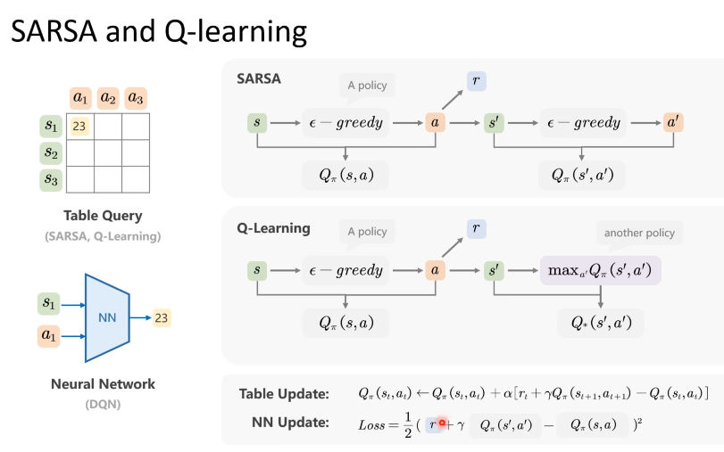

智界探索
1. AI agent
2. 多模态大模型qwen2.5 llava
3. 多模态大模型的评估
4. Cot
5. PPO DPO GRPO（RL for VLLM）
6. lora
7. moe
8. 药物重定位

1. prompt
   1. 任务说明 问题 上下文 输出格式
   2. zero few shot
   3. 优化prompt（prompt工程）
   4. 上下文学习：构造包含具体指令和相关上下文信息的详细清晰prompt
   5. 思维链cot
2. 上下文学习
   1. 通过构造特定prompt，使得模型理解并学习下游任务，不需要sft更新模型参数
   2. 定位到预训练阶段得到的相关知识概念。
      1. zero-shot
      2. one-shot
      3. few-shot
   3. 选择的shot要相似性，多样性
      1. 直接检索（相似性）：直接对于候选示例进行检索，选取Top K个示例，代表性方法有KATE；
      2. 聚类检索(多样性)：将候选序列划分为K个簇，每个簇中选择最相似的示例，最终获得K个示例，代表性方法是self-prompting
      3. 迭代检索（balance）：下一个示例的选择依赖于当前问题和已选的示例，先选取第一个示例，再将prompt与第一个示例结合检索第二个示例，以此迭代下去得到最终的prompt,balance了相似性和多样性，计算相对复杂，计算成本高
   4. 上下文学习收到预训练数据、预训练模型和演示示例等的影响。
   5. 不同任务对于示例要求不同
   6. 示例的顺序和数量也是影响上下文学习性能的关键因素。
3. CoT
   1. 人类的思维模式有system1和system2两种
      1. system1:快速、自动无意识地思考，得出答案（随着模型参数量，算力，数据增大，模型能力会持续上升）
      2. system2：思考过程缓慢，需要集中注意力和耗费精力，如逻辑分析题目（Flat scaling curves 模型能力提升缓慢）
   2. 思维链分类
      1. 按部就班（CoT）
         1. CoT手工构造一步一步推理回答问题的few shot
         2. Zero-Shot Cot 通过prompt直接让模型生成思维过程（Let's think step by step）
         3. Auto-CoT:给出该问题相关的问题的思维链过程，有一个问题库，通过kmeas等将问题与问题库中的问题进行聚类，再对这些问题用zero-shot cot.
      2. 三思后行(ToT)
         1. system2中复杂的问题，决策过程中需要多条思维链，维护和探索该思维，需要评估和回溯思维过程，考虑不同的思维路径。
         2. Tree of Thought,拆解，衍生，评估，搜索
         3. 允许模型在遇到困难或者不确定时进行回溯和重新选择
      3. 集思广益
         1. 汇集多种不同的观点和方法，进行投票，优化决策过程
         2. self-consistency 
            1. 推理路径生成，在随机采样策略下生成多种答案
            2. 汇总答案，统计每个答案出现的频率
            3. 选择答案：选择出现频率最高的答案作为最终的、最一致的答案。
         3. universal self-consistency:利用大模型本身选择最一致的答案
   3. GPT-o1在训练的时候用Cot，在回答问题前花费更多时间来思考，擅长处理科学、编程和数学领域等复杂问题。（逻辑推理能力变强，推理时间资源开销增加）
   结果监督变为过程监督（需要有思维过程 ）

    4. 谷歌 SCoRe
       1. 两阶段学习方法
          1. 针对模型第一次差强人意的回答，进行微调，使得第二次回答得更好，培养纠错意识
          2. 设计多轮强化学习面向自我纠正优化模型，增强模型自我纠正能力
4. Prompt技巧
   1. prompt编写规范（任务说明 问题 上下文 输出格式）
   2. 任务说明要明确
   3. 丰富且清晰的上下文
   4. 输出格式规范化，一般是json格式
   5. 排版要清晰（markdown格式等）
   6. 复杂问题拆解为更小更易于理解的问题，多轮回答
   7. 善用追问
   8. 适时使用Cot，复杂逻辑推理问题，CoT常用于规模更大的模型，根据不同的任务选择不同的答案，cot按部就班，tot需要创意性思维，有多种解法，在需要高可靠性性，安全性时，可以选择集思广益类（self-consisteency）
   9. 角色扮演，直接指定大模型是某个身份角色，直接定位到所需要的区域
   10. 将模型置于特定的“情景”或“环境”中
   11. prompt长度压缩问题，LLMLingua利用小模型迭代地检测prompt中不必要的token，最小化损失的同时能实现最高20倍的压缩率
5.  prompt相关应用
    1.  垂域任务
    2.  数据增强
    3.  agent

6. 参数高效微调
   1. 预训练任务难以直接适配到下游任务
   2. In-context可以在一定程度上适配到下游任务（模仿示例回答）
   3. In-context局限性
      1. 性能有限（依赖于shot）
      2. 人工成本高
      3. 推理效率低（few shot增加了token数量）
   4. 指令微调适配下游任务（prompt部分不计算损失）
      1. 构造指令数据集
         1. 数据集成
         2. 大模型生成
      2. 微调
   5. 全量微调的挑战
      1. 消耗大量存储和计算资源
      2. 全量微调效率低
   6. PEFT（parameter-efficient fine-tuning）参数高效微调，只更新一部分参数
      1. 优点
         1. 计算效率高
         2. 存储效率高
         3. 适应性强，无需重新训练整个模型，适应多种任务，能够达到全量微调的效果
      2. 主流方法
        
         1. 参数附加方法
         2. 参数选择方法
         3. 低秩适配方法
      3. 参数附加方法 
         1. 加在输入
        
        
        
        需要选择合适的soft-prompt长度和合理初始化
        优点：内存效率高，多任务能力，缩放特性（参数量增加，微调性能逐渐增强）
         2. 加在模型
        prefix-tuning
        
        除了在prompt embedding后增加参数，还在计算注意力层中加了参数
        
        adapter-tuning
        
        优点：参数效率，任务适应性，保持预训练知识
         3. 加在输出（修改logical层面）四两拨千斤
            1. 微调大模型常面临一下问题：大规模模型微调困难，黑盒模型
            2. proxy-tuning
            
            
            优点：轻松微调大语言模型，能微调黑盒模型，不需要原始模型惨重，只需要获得模型的输出分布
            在边缘端得到两个小模型（原始小模型和微调后的小模型）的输出差异，作用于云端的黑盒模型。
    
      4. 参数选择方法（微调部分参数）（不是主流）
         1. 基于规则的方法（基于专家经验）
            1. BitFit（仅优化神经网络的偏置项和分类头）在小规模性模型上验证过（BERT等）
            
            2. 仅微调transformer的特定层
         2. 基于学习的方法（通过学习将需要调整的参数找出来）
            1. Child-tuning
            通过mask矩阵（元素为0或1），只更新1上的神经元的值
            
            
            优点：微调成本低，适应性好
            缺点：在大规模模型上应用不多，不太使用，难以学习到规则或者掩码矩阵
      5. 低秩适配方法（LoRA）
         1. 通过低秩矩阵近似原始权重更新矩阵，并仅微调低秩矩阵，大幅度降低模型参数量。
        
        2. 本征维度假设：在低维子空间中进行参数更新，能实现与完整参数更新类似的性能
        对于某些维度重要性并不高，数据或者任务通常在一个低维流行上，模型只需关注与任务相关的特征，而不需要整个高维空间。
        本征维度：模型达到预期效果时最小参数空间的维度。
        
        3. LoRA (矩阵乘法，将一个矩阵分解为两个低秩矩阵乘积)
        
           1. LoRA的影响因素
              1. 权重初始化
                好的初始化能够提高学习过程稳定性，避免陷入局部最优，或者引起梯度爆炸/消失。
                通常B用0初始化，为了使得BA=0,在不微调时不会对网络产生影响。A用高斯分布初始化，保证A的值不会太大或者存在偏移，能够提高训练的稳定性。
               2. LoRA的秩
                秩大小会随着任务的复杂程度对性能产生不同的影响。
                简单任务使用较低的秩（高秩对模型的效果影响不大）。
                在跨领域任务或者复杂任务重，较高的秩往往效果更好。
               3. 放置位置
                FFN或者attention上
                只微调一种权重矩阵，放在FFN效果更好。
                保持微调总参数量不变，微调矩阵的种类越多效果越好。
            2. 微调时的内存占用（LoRA主要优化了梯度内存和优化器内存）
               1. 权重内存
               2. 激活内存
               3. 梯度内存
               4. 优化内存
            3. 优势
               1. 参数效率
               2. 插件化特性
               3. 跨任务泛化（多个插件组合）
            4. LoRA变体
               1. 性能改进
                AdaLoRA
                微调transformer时不同模块和层中的权重矩阵重要性不同
                
               2. 任务泛化
                LoRAHub
                组合不同任务上训练的LoRA模块提高模型对未见任务的适应性
               3. 训练改进
                QLoRA
                将高精度表示转换为低精度表示
                原始权重16bit量化到4bit存储，将LoRA参数保持16bit,节省权重内存。在前向和反向传播中，动态地将模型反量化到16bit参与计算，计算后将其释放
               4. 推理改进
                S-LoRA
                
                
                
   7. 应用场景
      1. continue pre-training
        
      2. continue learning(灾难性遗忘问题：学习了新任务忘记了旧任务)
        LoRA权重可以以插件形式进行管理与使用，根据具体任务插入或者拔出，天然具备连续学习的优势，具有插件化，任务特定，参数隔离的特点。
       3. 垂域数据微调
7. agentic reasoning design patterns
   1. 特点
      1. reflection
      2. rool use
      3. planning
      4. multi-agent collaboration
   2. prompt & workflow
8. RL
   1. state agent action environment reward next state
   2. 找到一个策略最大化奖励，在游戏中取胜
   3. 马尔科夫决策过程
      1. s1 a1 r1 s2 a2 r2 s3 ...
      2. st At Rt St+1 At+1 Rt+1 
      3. Return : R1 + R2 + ... + Rn
         1. 未来奖励不如即时奖励重要 乘以折扣因子γ
         
      4. randomness and expectation
         1.  policy pai(a|s)
         2.  state transition p(s'|s,a)
         3.  state value(某个状态下的期望回报)
         
         4. action value
         
         
      5. 做出最优决策有两种路径
         1. value-based
         找到动作状态价值函数最大的，最某个状态下执行该动作的回报最大
         
            1. temporal different
            how to estimate
            
            2. 得到Q的计算方法后，找到Q的最大值，进行动作选择
            
            sarsa on-policy
            q-learning off-policy
            target policy:目标策略，agent学习时使用的策略
            behavior policy:决定下一步的策略
         2. policy-based
         找到在某个状态下执行动作的概率分布
         
          
            1. 求解Q引出了两种算法（REINFORCE & Actor-Critic）
            2. REINFORCE使用蒙特卡洛用多次试验的均值代替Q
            3. Actor-Critic
            使用神经网络估计Q
            （sarsa）
            
            3. TRPO(难以选择合适的学习率，容易使得模型训崩，因此可以添加一个可行域，约束参数的选择范围（KL散度限制两个分布尽可能一样），同时保持优化上升)
            优势函数A：做出一个动作后Q（s, a）比V（s）的优势
            
            4. PPO（改进TRPO 求解方便）
            
            广义优势估计，估计多步
            

9. 智界探索一面
   1.  CLIP、transformer、gpt
   2.  现在SGG领域的sota模型
   3.  怎么进行改进，算法迭代（要体现出这种思维）
   4.  yolo中种类变多，遮挡，小目标等问题
10. 模型编辑的定义与性质
    1.  大语言模型中存在偏见、毒性和知识错误等一系列问题
    2.  大模型中的偏见
        1.  直接输出偏见（比如不同性别下输出，可能隐藏着偏见）
        2.  嵌入空间偏见
    3. 大模型中的毒性
       1. 指的是模型生成的内容包含有害部分
    4. 知识错误
       1. 指的是模型提供的信息与事实不符
    5. 可能的解决方案
       1. 回炉重造（重新预训练），训练成本高
       2. 微调，过拟合，灾难性遗忘
       3. 精准高效地修正大模型的特定知识点，避免对大模型大范围的调整：模型编辑
    6. 模型编辑
       1. 针对特定知识点对模型进行编辑，旨在修正大模型使其输出期望结果，同时不影响其他输出
       2. 类比于人类学习，在与其他人交流过程中，人们会对特定知识点进行探讨，从而纠正自己在该知识点上的错误
    7. 模型编辑的挑战
       1. 不可错误编辑
       2. 不可只顾自己
       3. 不能顾此失彼（相关知识点也要编辑）
       4. 不可伤及无辜（无关知识点不编辑）
    8. 模型编辑的性质：
       1. accuracy
       2. generality
       3. portability
       4. locality
       5. efficiency
    9. 模型编辑分类
       1.  外部扩展法（设计特定的外置知识体）
           1. 知识缓存法
           2. 附加参数法
       2.  内部修改法（修改模型内部的特定层或神经元）
           1.  元学习法（learning to learn）超网络
           2.  定位编辑法
       3. 附加参数法：T-Patcher
      
   